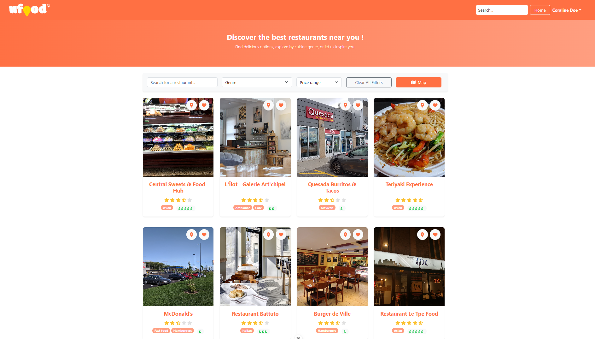

# Ufood

Application web de découverte de restaurants permettant aux utilisateurs de rechercher des établissements, consulter des avis, créer des listes de favoris et suivre d'autres utilisateurs.


## Apercu

<!-- Ajouter une capture d'ecran de l'application ici -->
<!--  -->

## Fonctionnalites

- **Recherche de restaurants** : filtrage par nom, genre culinaire et fourchette de prix
- **Carte interactive** : visualisation des restaurants sur une carte avec itineraires
- **Systeme de favoris** : creation et gestion de listes personnalisees
- **Avis et visites** : notation et commentaires sur les restaurants visites
- **Profils utilisateurs** : systeme de followers avec consultation des activites
- **Authentification** : inscription et connexion securisees

## Stack technique

| Categorie | Technologies |
|-----------|--------------|
| Framework | Vue.js 3 (Composition API) |
| Routing | Vue Router |
| State | Pinia |
| HTTP | Axios |
| UI | Bootstrap 5, FontAwesome |
| Cartographie | Leaflet / OpenStreetMap |
| Build | Vite |
| Tests | Vitest |
| Qualite | ESLint, Prettier, Husky |

## Rôle et responsabilités

Dans ce projet développé dans un cadre universitaire, j'ai été responsable des éléments suivants :

- Développement de composants Vue.js réutilisables
- Mise en place du système de gestion d'état avec Pinia
- Intégration et consommation de l'API REST, avec gestion des erreurs
- Implémentation de la carte interactive avec Leaflet
- Configuration des outils de qualité de code (ESLint, Prettier)

## Installation

**Prerequis** : Node.js (version LTS recommandee)

```bash
# Cloner le depot
git clone https://github.com/[username]/Ufood.git
cd Ufood

# Installer les dependances
npm install

# Lancer le serveur de developpement
npm run dev
```

L'application sera accessible sur `http://localhost:5175`

## Scripts disponibles

| Commande | Description |
|----------|-------------|
| `npm run dev` | Serveur de developpement |
| `npm run build` | Build de production |
| `npm run preview` | Previsualisation du build |
| `npm run test:unit` | Tests unitaires |
| `npm run lint` | Verification du code |

## Structure du projet

```
src/
├── components/     # Composants reutilisables
│   ├── Favorite/   # Gestion des favoris
│   ├── Map/        # Carte interactive
│   ├── Restaurant/ # Affichage restaurants
│   ├── User/       # Profils utilisateurs
│   └── Visit/      # Visites et avis
├── pages/          # Pages de l'application
├── services/       # Appels API et logique metier
├── stores/         # Gestion d'etat (Pinia)
├── models/         # Modeles de donnees
├── router/         # Configuration des routes
└── utils/          # Fonctions utilitaires
```

## Contexte

Projet developpe dans le cadre du cours de developpement web a l'Universite Laval. L'application consomme une API REST fournie et met l'accent sur les bonnes pratiques de developpement front-end Vue.js.

---

*Projet academique - Disponible pour un stage en developpement front-end*
